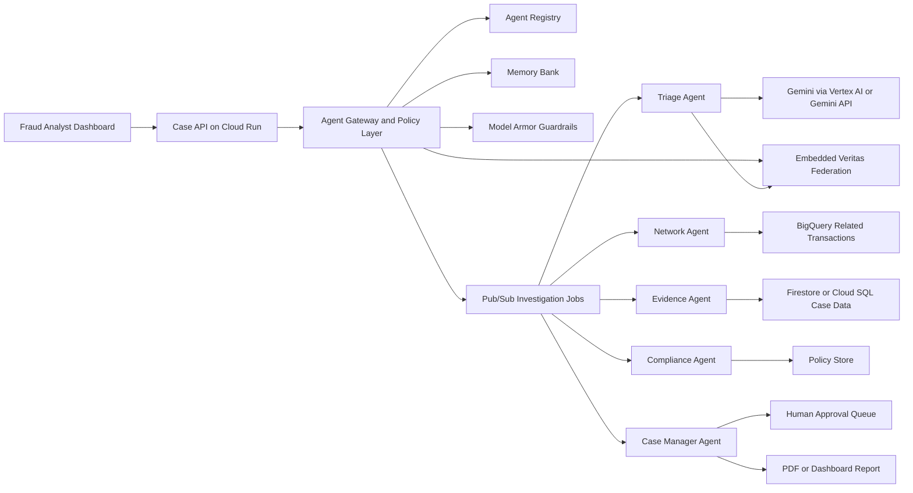

# TraceLayer

TraceLayer is a fraud investigation agent fleet for banks, insurers, and fintech teams. It turns a suspicious transaction into an auditable investigation case by coordinating specialized agents for triage, network discovery, evidence collection, compliance checks, and human approval.

TraceLayer now embeds selected Veritas federated-fraud primitives directly in the backend. It does not call a separate Veritas API for the demo path; the Triage Agent consumes an in-process federated risk signal built from secure aggregation, differential privacy accounting, and provenance hashing.

Secrets never belong in the dashboard. The browser calls the TraceLayer backend only; Gemini, Vertex AI, Firestore, BigQuery, Pub/Sub, and Secret Manager access stay behind the FastAPI service boundary.

The project is designed for the **Fortified Enterprise Fleet** track of the All Things Agentic Hackathon. It demonstrates enterprise agent concepts such as agent identity, persistent memory, guarded model calls, policy-aware tool access, asynchronous work distribution, and human-in-the-loop controls.

## Current Build Depth

TraceLayer now includes concrete enterprise controls in the runnable backend:

| Control | Implementation |
| --- | --- |
| Agent Identity | `AgentRegistry` assigns service identities, versions, permissions, and data access classes. |
| Agent Gateway | `AgentGateway` authorizes every agent run before execution. |
| Least Privilege | `PolicyEngine` checks role scopes, agent permissions, and data classification. |
| Model Armor Boundary | `ModelArmorGuardrail` scans model inputs and outputs for prompt injection and PII. |
| Memory Bank | `MemoryBank` stores append-only local snapshots; `FirestoreMemoryBank` stores deployed case state and approval updates. |
| Audit Ledger | `AuditLedger` writes hash-chained JSONL events for tamper-evident review. |
| Human Approval | High-risk actions produce approval requests; final action requires supervisor approval. |
| Embedded Veritas Federation | `VeritasFederatedRiskEngine` produces cross-institution risk signals without raw record movement. |

## Demo Scenario

A customer's overseas wire transfer is flagged as suspicious.

TraceLayer will:

1. Score the transaction and assign investigation priority.
2. Generate an embedded Veritas federated risk signal from simulated bank, insurer, and fintech nodes.
3. Find related accounts, devices, IP addresses, emails, and counterparties.
4. Build a chronological evidence timeline from transaction, policy, and federated provenance data.
5. Check for PII exposure, policy violations, and unsafe automation.
6. Generate a case summary and request human approval for high-risk actions.

## Agent Fleet

| Agent | Responsibility |
| --- | --- |
| Triage Agent | Scores suspicious activity and decides investigation priority. |
| Network Agent | Finds links across accounts, devices, IPs, emails, and counterparties. |
| Evidence Agent | Builds the evidence timeline from transaction records and internal policy. |
| Compliance Agent | Checks PII exposure, access boundaries, policy conflicts, and tool safety. |
| Case Manager Agent | Maintains case state and requests human approval for high-risk actions. |

## Embedded Veritas Layer

TraceLayer imports the useful Veritas concepts into `services/api/app/federation`:

| Module | Veritas Concept |
| --- | --- |
| `secure_agg.py` | Bonawitz-style additive pairwise masking for secure sum. |
| `dp.py` | Clip + Gaussian noise and RDP privacy accounting. |
| `engine.py` | Federated fraud signal generation for the Triage Agent. |

The local demo simulates three institutional nodes:

- `bank-na-01`
- `insurer-claims-02`
- `fintech-wallet-03`

Each node produces a clipped and noised local update. TraceLayer securely aggregates those updates and stores only the aggregate signal, DP summary, campaign signature, and provenance hash in the investigation case.

## Architecture



More detail is available in [docs/architecture.md](docs/architecture.md).

## Repository Layout

```text
.
├── apps/dashboard/          # Static demo dashboard
├── data/                    # Mock transactions, customers, and policy data
├── docs/                    # Architecture, demo script, and submission notes
├── infra/                   # Cloud Run and Pub/Sub deployment stubs
└── services/api/            # FastAPI service and agent fleet implementation
```

## Local Quickstart

```bash
cd services/api
python -m venv .venv
source .venv/bin/activate
pip install -e ".[dev]"
cp ../../.env.example .env
uvicorn app.main:app --reload --port 8080
```

Open the API:

```text
http://localhost:8080/docs
```

Run the demo case:

```bash
curl -X POST http://localhost:8080/cases/demo
```

Run with explicit role headers:

```bash
curl -X POST http://localhost:8080/cases/demo \
  -H "X-Tracelayer-User: analyst@example.com" \
  -H "X-Tracelayer-Role: supervisor"
```

Approve a high-risk case:

```bash
curl -X POST http://localhost:8080/cases/case-tx-9001/approval \
  -H "Content-Type: application/json" \
  -H "X-Tracelayer-User: supervisor@example.com" \
  -H "X-Tracelayer-Role: supervisor" \
  -d '{
    "approval_id": "appr-case-tx-9001",
    "decision": "approved",
    "reason": "Supervisor approved a temporary outbound transfer hold for demo."
  }'
```

Verify the audit chain:

```bash
curl http://localhost:8080/audit/verify \
  -H "X-Tracelayer-Role: compliance"
```

Open the static dashboard:

```text
apps/dashboard/index.html
```

Open the supervisor approval console:

```text
apps/dashboard/admin.html
```

The dashboard can call the local API if it is running. Otherwise, it falls back to an embedded demo case. To point the dashboard at a deployed backend, copy `apps/dashboard/config.example.js` to `apps/dashboard/config.js` and set only the backend URL:

```js
window.TRACELAYER_API_BASE = "https://YOUR_CLOUD_RUN_URL";
```

Do not put Gemini, Google Cloud, or API keys in dashboard files.

## Google Cloud Mapping

| Capability | Local Skeleton | Google Cloud Target |
| --- | --- | --- |
| Runtime | FastAPI process | Cloud Run |
| Agent framework boundary | Agent classes under `services/api/app/agents` | Google ADK or GenAI SDK agent wrappers |
| Transaction store | JSON files in `data/` | Firestore, Cloud SQL, or BigQuery |
| Related transaction search | In-memory graph search | BigQuery |
| Async work distribution | Direct orchestrator call | Pub/Sub topics |
| Memory bank | Local JSONL append-only snapshots | Firestore case documents with append-only snapshot subcollections |
| Model calls | Mock reasoner by default | Gemini 3.5 Flash or newer via Vertex AI/Gemini API |
| Guardrails | Compliance checks and redaction utilities | Model Armor and Agent Gateway policies |
| Audit evidence | Markdown report output | Cloud Logging, Trace, BigQuery audit tables, PDF export |

## Environment Variables

See [.env.example](.env.example) for the local configuration template.

Important values:

| Variable | Purpose |
| --- | --- |
| `USE_MOCK_DATA` | Keeps the demo deterministic without cloud credentials. |
| `AI_PROVIDER` | Selects `mock`, `gemini_api`, `vertex_ai`, or `auto` on the backend. |
| `GEMINI_API_KEY` | Enables backend-only Gemini API calls in `gemini_api` mode. |
| `GEMINI_MODEL` | Defaults to `gemini-2.5-flash`, a broadly available Vertex AI Flash model. |
| `GOOGLE_CLOUD_PROJECT` | Project used by Cloud Run, Pub/Sub, BigQuery, and Firestore. |
| `MEMORY_BACKEND` | Selects `local`, `firestore`, or `auto` case memory persistence. |
| `FIRESTORE_DATABASE` | Firestore database ID for deployed case state. |
| `FIRESTORE_CASE_COLLECTION` | Firestore collection for case records and snapshot history. |
| `SECURITY_MODE` | Use `permissive` locally and `enforcing` for deployed API-key checks. |
| `AUDIT_LEDGER_PATH` | Local hash-chained audit log path. |
| `MEMORY_BANK_PATH` | Local append-only case memory path. |

## Development Commands

```bash
cd services/api
pytest
python -m compileall app
python -c "from app.config import Settings; from app.fleet import FraudInvestigationFleet; print(FraudInvestigationFleet(Settings()).investigate('tx-9001').case_id)"
```

Or from the repository root:

```bash
make verify-core
make demo
make test
make run-api
```

## Submission Checklist

The hackathon submission should include:

1. Hosted project URL or recorded local demo.
2. Code repository URL.
3. Architecture diagram from `docs/architecture.mmd`.
4. Four-minute demo video showing Cloud Run or Google Cloud evidence.
5. Short write-up covering problem, value proposition, features, technologies, and learnings.

See [docs/submission-checklist.md](docs/submission-checklist.md) for a more detailed checklist.

## Security Documentation

- [docs/security/threat-model.md](docs/security/threat-model.md)
- [docs/security/controls.md](docs/security/controls.md)
- [infra/iam/least-privilege.md](infra/iam/least-privilege.md)

## Backend-only AI Providers

Use one of these backend modes:

```env
AI_PROVIDER=mock
```

```env
AI_PROVIDER=gemini_api
GEMINI_API_KEY=...
GEMINI_MODEL=gemini-2.5-flash
```

```env
AI_PROVIDER=vertex_ai
GOOGLE_CLOUD_PROJECT=project-6ecbea1e-e0c3-4325-a63
GOOGLE_CLOUD_LOCATION=us-central1
GEMINI_MODEL=gemini-2.5-flash
```

The dashboard never receives these secrets. It only calls `/cases/demo`, `/cases/investigate`, and `/runtime/config` on the backend.

The admin console calls `/approvals/pending`, `/cases/{case_id}`, and `/cases/{case_id}/approval` with supervisor headers. In deployed enforcing mode, enter the demo API key in the admin console or send it through a trusted internal gateway.
