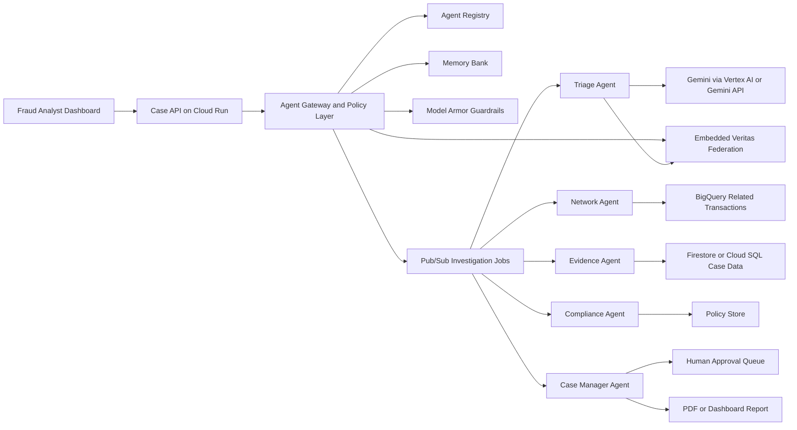

# TraceLayer

TraceLayer is a fraud investigation agent fleet for banks, insurers, and fintech teams. It turns a suspicious transaction into an auditable investigation case by coordinating specialized agents for triage, network discovery, evidence collection, compliance checks, and human approval.

TraceLayer now embeds selected Veritas federated-fraud primitives directly in the backend. It does not call a separate Veritas API for the demo path; the Triage Agent consumes an in-process federated risk signal built from secure aggregation, differential privacy accounting, and provenance hashing.

Secrets never belong in the dashboard. The browser calls the TraceLayer backend only; Gemini, Vertex AI, Firestore, BigQuery, Pub/Sub, and Secret Manager access stay behind the FastAPI service boundary.

The project is designed for the **Fortified Enterprise Fleet** track of the All Things Agentic Hackathon. It demonstrates enterprise agent concepts such as agent identity, persistent memory, guarded model calls, policy-aware tool access, asynchronous work distribution, and human-in-the-loop controls.

## Current Demo Status

The current deployed demo runs on Cloud Run with authenticated access, backend-only Vertex AI Gemini calls, Google ADK agent definitions for the core fleet, Firestore-backed case/job state, randomized fraud scenarios, and a supervisor admin console.

| Area | Current Status |
| --- | --- |
| Cloud Run API | Deployed as `tracelayer-api`; direct browser access is private by design. |
| Demo Dashboard | `/dashboard` shows case summary, agent-generated investigation plan, agent findings, interactive 3D network graph, fraud campaign detection, privacy-separated Veritas signal, network links, compliance, approval state, async job state, and Agent Registry. |
| Admin Console | `/admin` lists pending approvals and approval history; supervisors can accept, deny, request more evidence, and tune stored risk thresholds. |
| Randomized Demo Cases | `Run Demo Case` rotates across multiple flagged transactions with low, medium, high, critical, and missing-data paths while avoiding recent repeats. |
| Async Demo Flow | `Run Async Demo` enqueues an investigation job; Cloud Run receives the real Pub/Sub push at `/pubsub/investigations` and stores job completion in Firestore. |
| AI Provider | `vertex_ai` in Cloud Run, with `gemini-2.5-flash` configured backend-only. |
| Google ADK | Triage, Network, and Case Manager agents bind to real `google.adk` `Agent` definitions when the package is installed. |
| Memory | Firestore persists case snapshots, approval decisions, and async investigation jobs. |
| Network Search | BigQuery-aware connector runs in `auto` mode and safely falls back to local demo data if BigQuery is not ready. |

## Current Build Depth

TraceLayer now includes concrete enterprise controls in the runnable backend:

| Control | Implementation |
| --- | --- |
| Agent Identity | `AgentRegistry` assigns service identities, versions, permissions, and data access classes. |
| Google ADK Runtime | `AdkAgentRuntime` creates Google ADK `Agent` definitions for Triage, Network, and Case Manager and records runtime metadata in each case output. |
| Agent Gateway | `AgentGateway` authorizes every agent run before execution. |
| Dynamic Planning | `CaseManagerPlanningAgent` creates an initial triage-first plan, replans after risk scoring, and the fleet executes only the selected action handlers. |
| Least Privilege | `PolicyEngine` checks role scopes, agent permissions, and data classification. |
| Model Armor Boundary | `ModelArmorGuardrail` scans model inputs and outputs for prompt injection and PII. |
| Memory Bank | `MemoryBank` stores append-only local snapshots; `FirestoreMemoryBank` stores deployed case state and approval updates. |
| Audit Ledger | `AuditLedger` writes hash-chained JSONL events for tamper-evident review. |
| Risk Policy Store | `RiskPolicyStore` persists medium, high, and critical thresholds locally or in Firestore. |
| Human Approval | Medium-risk cases create manual review requests; high-risk actions require supervisor approval before any hold. Reviewers can request more evidence, which reruns Evidence, Compliance, and Case Manager agents. |
| Embedded Veritas Federation | `VeritasFederatedRiskEngine` produces cross-institution risk signals without raw record movement. |
| BigQuery Network Boundary | `BigQueryNetworkSearch` uses parameterized BigQuery queries when available and records fallback metadata. |
| Live Network Graph | `NetworkAgent` emits graph nodes and edges for trigger transactions, related transactions, and shared entities; the dashboard renders them as a draggable, zoomable Three.js graph whenever a live case update arrives. |
| Fraud Campaign Detection | `NetworkAgent` combines shared-infrastructure links with the federated campaign signature to flag clustered fraud campaigns and recommend escalation. |
| Pub/Sub Worker | `GooglePubSubBus` publishes queued work to Pub/Sub; authenticated push delivery invokes `/pubsub/investigations` on Cloud Run. |
| Async Job State | `InvestigationJob` stores queued/running/succeeded/failed state in local JSONL or Firestore. |
| Agent Registry UI | Dashboard renders service accounts, permissions, versions, and data access classes from `/agents`. |
| Prompt Injection Demo | `tx-9701` includes a malicious external memo; Model Armor blocks it from Gemini prompts while the investigation continues. |
| Cloud Logging Trace | Structured JSON logs include `case_id`, `agent_id`, `agent_version`, `tool`, `latency_ms`, `status`, and Cloud Trace correlation fields. |

## Demo Scenario

A customer's overseas wire transfer is flagged as suspicious.

TraceLayer will:

1. Score the transaction and assign investigation priority.
2. Ask the Case Manager Agent to create an initial investigation plan.
3. Run Triage, then let the Case Manager replan from the actual risk, federated signal, and missing-data state.
4. Execute only the planned action handlers for the case priority.
5. Render a live local network graph and detect whether the links form a fraud campaign.
6. Check for PII exposure, policy violations, and unsafe automation.
7. Generate a case summary, route medium-risk cases to analyst review, and request supervisor approval for high-risk actions.

The planner changes the workflow by risk:

| Priority | Planned Strategy | Agent Steps |
| --- | --- | --- |
| Low | `lightweight_review` | Triage, Compliance, Close |
| Medium | `manual_review` | Triage, Evidence, Compliance, Case Manager |
| High / Critical | `deep_network_investigation` | Triage, Federated Intelligence, Network, Evidence, Compliance, Human Approval |
| Missing Data | `pause_for_more_data` | Triage, Request More Data, Pause |

The demo currently includes nine flagged trigger scenarios:

| Trigger | Expected Priority | Scenario |
| --- | --- | --- |
| `tx-9301` | Low | Low-value domestic card alert that remains open for analyst review. |
| `tx-9401` | Medium | Moderate cross-border ACH vendor payment routed to manual analyst review without an asset hold request. |
| `tx-9501` | Medium | Domestic high-value ACH payment with elevated federated signal, routed to manual review before closure. |
| `tx-9201` | High | Small-business ACH case with high amount, velocity, shared IP, and unusual-hour signals. |
| `tx-9601` | High | Cross-border wire with shared IP and unusual timing, requiring supervisor approval. |
| `tx-9001` | Critical | High-value overseas wire transfer to Singapore with unusual timing and shared infrastructure. |
| `tx-9101` | Critical | High-value UAE wire transfer with shared device, IP, and counterparty signals. |
| `tx-9701` | Critical | Prompt injection live demo: external memo asks the model to ignore instructions and export customer account numbers. |
| `tx-9801` | Missing Data | Incomplete ACH alert that causes the Case Manager to request additional evidence and pause. |

## Live Security Demo

Use `Run Attack Demo` on the dashboard to trigger `tx-9701`.

Expected result:

1. Triage detects prompt injection in the external transaction memo.
2. The malicious memo is blocked from the Gemini prompt.
3. PII access is denied.
4. The investigation continues with structured transaction features.
5. Guardrails show blocked prompt-injection findings.
6. Cloud Logging receives structured trace entries for every agent run.

Cloud Logging query shape:

```text
resource.type="cloud_run_revision"
resource.labels.service_name="tracelayer-api"
jsonPayload.case_id="CASE_ID"
```

For agent-level filtering:

```text
resource.type="cloud_run_revision"
resource.labels.service_name="tracelayer-api"
jsonPayload.agent_id="triage-agent"
jsonPayload.status="succeeded"
```

## Agent Fleet

| Agent | Responsibility |
| --- | --- |
| Triage Agent | Scores suspicious activity and decides investigation priority. |
| Network Agent | Runs related-transaction search only when selected by the plan, builds a live graph of shared entities, and detects fraud-campaign clusters when local network evidence corroborates federated signatures. |
| Evidence Agent | Builds the evidence timeline from transaction records and internal policy. |
| Compliance Agent | Checks PII exposure, access boundaries, policy conflicts, and tool safety. |
| Case Manager Agent | Builds the initial and post-triage investigation plans, maintains case state, routes medium-risk cases to analyst review, pauses missing-data cases, and requests supervisor approval for high-risk actions. |

## Embedded Veritas Layer

TraceLayer imports the useful Veritas concepts into `services/api/app/federation`:

| Module | Veritas Concept |
| --- | --- |
| `secure_agg.py` | Bonawitz-style additive pairwise masking for secure sum. |
| `dp.py` | Clip + Gaussian noise and RDP privacy accounting. |
| `engine.py` | Federated fraud signal generation for the Triage Agent. |

The local demo simulates three institutional nodes:

- `bank-na-01`
- `insurer-claims-02`
- `fintech-wallet-03`

Each node produces a clipped and noised local update. TraceLayer securely aggregates those updates and stores only the aggregate signal, DP summary, campaign signature, and provenance hash in the investigation case.

## Architecture



More detail is available in [docs/architecture.md](docs/architecture.md).

## Repository Layout

```text
.
├── apps/dashboard/          # Static demo dashboard
├── data/                    # Mock transactions, customers, and policy data
├── docs/                    # Architecture, demo script, and submission notes
├── infra/                   # Cloud Run and Pub/Sub deployment stubs
└── services/api/            # FastAPI service and agent fleet implementation
```

## Local Quickstart

```bash
cd services/api
python -m venv .venv
source .venv/bin/activate
pip install -e ".[dev]"
cp ../../.env.example .env
uvicorn app.main:app --reload --port 8080
```

Open the API:

```text
http://localhost:8080/docs
```

Open local UI pages through the API server:

```text
http://localhost:8080/dashboard
http://localhost:8080/admin
```

Run the demo case:

```bash
curl -X POST http://localhost:8080/cases/demo
```

Run with explicit role headers:

```bash
curl -X POST http://localhost:8080/cases/demo \
  -H "X-Tracelayer-User: analyst@example.com" \
  -H "X-Tracelayer-Role: supervisor"
```

Approve a high-risk case:

```bash
curl -X POST http://localhost:8080/cases/case-tx-9001/approval \
  -H "Content-Type: application/json" \
  -H "X-Tracelayer-User: supervisor@example.com" \
  -H "X-Tracelayer-Role: supervisor" \
  -d '{
    "approval_id": "appr-case-tx-9001",
    "decision": "approved",
    "reason": "Supervisor approved a temporary outbound transfer hold for demo."
  }'
```

Verify the audit chain:

```bash
curl http://localhost:8080/audit/verify \
  -H "X-Tracelayer-Role: compliance"
```

Run the Pub/Sub-style async demo flow locally:

```bash
JOB_ID=$(curl -s -X POST http://localhost:8080/cases/demo/async \
  -H "X-Tracelayer-User: supervisor@example.com" \
  -H "X-Tracelayer-Role: supervisor" \
  | python -c "import json,sys; print(json.load(sys.stdin)['job_id'])")

curl -X POST "http://localhost:8080/jobs/$JOB_ID/run" \
  -H "X-Tracelayer-User: supervisor@example.com" \
  -H "X-Tracelayer-Role: supervisor"

curl "http://localhost:8080/jobs/$JOB_ID" \
  -H "X-Tracelayer-Role: supervisor"
```

The dashboard can call the local API if it is running. Otherwise, it falls back to an embedded demo case. To point the dashboard at a deployed backend, copy `apps/dashboard/config.example.js` to `apps/dashboard/config.js` and set only the backend URL:

```js
window.TRACELAYER_API_BASE = "https://YOUR_CLOUD_RUN_URL";
```

Do not put Gemini, Google Cloud, or API keys in dashboard files.

## Deployed Demo Access

The deployed Cloud Run service is private. Use a local authenticated proxy:

```bash
gcloud run services proxy tracelayer-api \
  --region us-central1 \
  --project project-6ecbea1e-e0c3-4325-a63 \
  --port 8099
```

Then open:

```text
http://127.0.0.1:8099/dashboard
http://127.0.0.1:8099/admin
```

Use the demo API key when the admin console asks for it:

```text
local-demo-key
```

Expected demo path:

1. Open `/dashboard`.
2. Click `Run Demo Case` for synchronous investigation.
3. Click `Run Async Demo` to show queued job state and Pub/Sub worker completion.
4. Review `Agent Registry` to show agent identity, permissions, and data access.
5. Open `/admin`.
6. Approve, deny, or request more evidence for pending cases.
7. Return to `/dashboard` and confirm the approval status updates through browser live sync.

## Google Cloud Mapping

| Capability | Local Skeleton | Google Cloud Target |
| --- | --- | --- |
| Runtime | FastAPI process | Cloud Run |
| Agent framework boundary | `AdkAgentRuntime` plus agent classes under `services/api/app/agents` | Google ADK agent runtime with GenAI/Vertex model access |
| Transaction store | JSON files in `data/` | Firestore, Cloud SQL, or BigQuery |
| Related transaction search | JSON repository fallback | BigQuery via `BigQueryNetworkSearch` |
| Async work distribution | Local job enqueue plus manual worker route | Pub/Sub push subscription invoking `/pubsub/investigations` on Cloud Run |
| Memory bank | Local JSONL append-only snapshots | Firestore case and job collections |
| Model calls | Mock, Gemini API, or Vertex AI | Gemini through Vertex AI with service account credentials |
| Guardrails | Compliance checks and redaction utilities | Model Armor and Agent Gateway policies |
| Audit evidence | Markdown report output | Cloud Logging, Trace, BigQuery audit tables, PDF export |

## API Surface

| Endpoint | Purpose |
| --- | --- |
| `GET /runtime/config` | Returns safe runtime metadata without secrets. |
| `GET /agents` | Lists registered agent identities, permissions, and data access classes. |
| `POST /cases/demo` | Runs a randomized synchronous demo investigation. |
| `POST /cases/demo/async` | Enqueues a Pub/Sub-style investigation job. |
| `POST /pubsub/investigations` | Receives authenticated Pub/Sub push messages and runs queued investigation jobs. |
| `POST /jobs/{job_id}/run` | Runs the worker step for a queued investigation job. |
| `GET /jobs/{job_id}` | Reads async job status and generated case ID. |
| `POST /cases/investigate` | Runs investigation for an explicit transaction ID. |
| `GET /cases/{case_id}` | Reads a persisted case from the memory bank. |
| `GET /approvals/pending` | Lists pending supervisor approval requests. |
| `GET /approvals/log` | Lists pending, approved, denied, and more-evidence approval history. |
| `GET /risk-policy` | Reads the active medium, high, and critical risk thresholds. |
| `PUT /risk-policy` | Persists supervisor-updated risk thresholds for future investigations. |
| `POST /cases/{case_id}/approval` | Accepts, denies, or requests more evidence for a human approval request. |
| `GET /cases/{case_id}/audit` | Reads hash-chained audit events for a case. |
| `GET /audit/verify` | Verifies the local audit chain. |

## Environment Variables

See [.env.example](.env.example) for the local configuration template.

Important values:

| Variable | Purpose |
| --- | --- |
| `USE_MOCK_DATA` | Keeps the demo deterministic without cloud credentials. |
| `AI_PROVIDER` | Selects `mock`, `gemini_api`, `vertex_ai`, or `auto` on the backend. |
| `ADK_ENABLED` | Enables Google ADK agent definition binding for the core fleet. |
| `ADK_MODEL` | Optional ADK model override; defaults to `GEMINI_MODEL`. |
| `GEMINI_API_KEY` | Enables backend-only Gemini API calls in `gemini_api` mode. |
| `GEMINI_MODEL` | Defaults to `gemini-2.5-flash`, a broadly available Vertex AI Flash model. |
| `GOOGLE_CLOUD_PROJECT` | Project used by Cloud Run, Pub/Sub, BigQuery, and Firestore. |
| `PUBSUB_BACKEND` | Selects `auto`, `local`, or `google` for async investigation work distribution. |
| `PUBSUB_TOPIC_INVESTIGATIONS` | Pub/Sub topic used by queued investigation jobs. |
| `PUBSUB_TOPIC_APPROVALS` | Pub/Sub topic used for approval-request events. |
| `PUBSUB_PUSH_SUBSCRIPTION` | Name of the push subscription targeting `/pubsub/investigations`. |
| `NETWORK_SEARCH_BACKEND` | Selects `auto`, `local`, or `bigquery` for related-transaction search. |
| `BIGQUERY_TRANSACTIONS_TABLE` | Fully qualified BigQuery table for the Network Agent search path. |
| `NETWORK_SEARCH_TIMEOUT_SECONDS` | Short BigQuery fallback timeout for demo-safe auto mode. |
| `MEMORY_BACKEND` | Selects `local`, `firestore`, or `auto` case memory persistence. |
| `FIRESTORE_DATABASE` | Firestore database ID for deployed case state. |
| `FIRESTORE_CASE_COLLECTION` | Firestore collection for case records and snapshot history. |
| `FIRESTORE_JOB_COLLECTION` | Firestore collection for async investigation job state. |
| `FIRESTORE_POLICY_COLLECTION` | Firestore collection for active risk threshold policy. |
| `RISK_POLICY_PATH` | Optional local JSON path for the active risk threshold policy. |
| `SECURITY_MODE` | Use `permissive` locally and `enforcing` for deployed API-key checks. |
| `AUDIT_LEDGER_PATH` | Local hash-chained audit log path. |
| `MEMORY_BANK_PATH` | Local append-only case memory path. |
| `INVESTIGATION_JOB_PATH` | Local append-only async job state path. |

## Development Commands

```bash
cd services/api
pytest
python -m compileall app
python -c "from app.config import Settings; from app.fleet import FraudInvestigationFleet; print(FraudInvestigationFleet(Settings()).investigate('tx-9001').case_id)"
```

Or from the repository root:

```bash
make verify-core
make demo
make test
make run-api
```

## Submission Checklist

The hackathon submission should include:

1. Hosted project URL or recorded local demo.
2. Code repository URL.
3. Architecture diagram from `docs/architecture.mmd`.
4. Four-minute demo video showing Cloud Run or Google Cloud evidence.
5. Short write-up covering problem, value proposition, features, technologies, and learnings.

See [docs/submission-checklist.md](docs/submission-checklist.md) for a more detailed checklist.

## Security Documentation

- [docs/security/threat-model.md](docs/security/threat-model.md)
- [docs/security/controls.md](docs/security/controls.md)
- [infra/iam/least-privilege.md](infra/iam/least-privilege.md)

## Backend-only AI Providers

Use one of these backend modes:

```env
AI_PROVIDER=mock
```

```env
AI_PROVIDER=gemini_api
GEMINI_API_KEY=...
GEMINI_MODEL=gemini-2.5-flash
```

```env
AI_PROVIDER=vertex_ai
GOOGLE_CLOUD_PROJECT=project-6ecbea1e-e0c3-4325-a63
GOOGLE_CLOUD_LOCATION=us-central1
GEMINI_MODEL=gemini-2.5-flash
```

The dashboard never receives these secrets. It only calls `/cases/demo`, `/cases/investigate`, and `/runtime/config` on the backend.

For the Pub/Sub-style flow, the dashboard can call `/cases/demo/async`, invoke the worker route `/jobs/{job_id}/run`, then poll `/jobs/{job_id}` until the job returns a `case_id`. In Cloud Run, job state is persisted through Firestore when `MEMORY_BACKEND=firestore`.

The admin console calls `/approvals/pending`, `/cases/{case_id}`, and `/cases/{case_id}/approval` with supervisor headers. In deployed enforcing mode, enter the demo API key in the admin console or send it through a trusted internal gateway.
