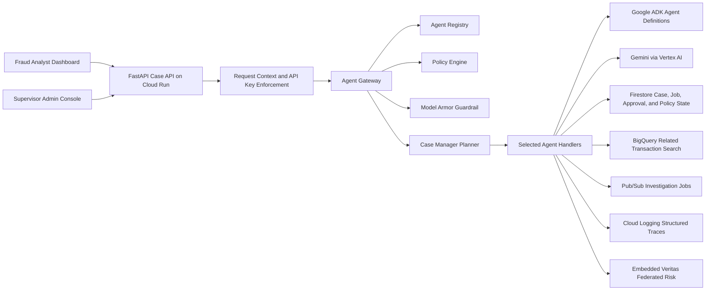
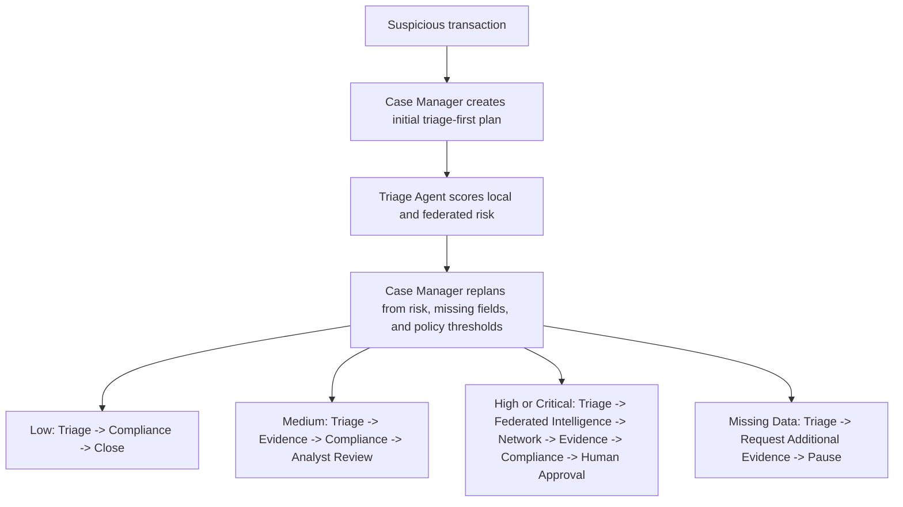
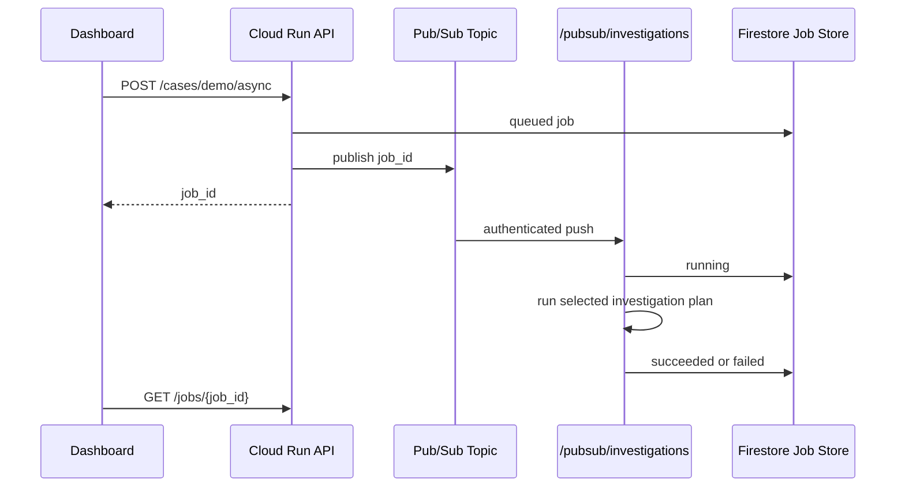
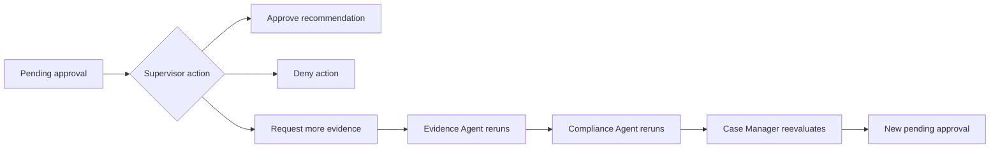

# TraceLayer Architecture

TraceLayer is an enterprise fraud investigation agent fleet. It uses specialized agents, but the important orchestration behavior is not a fixed pipeline: the Case Manager creates an investigation plan, the Triage Agent produces risk and federated intelligence, and the Case Manager replans before selecting the next handlers.

## System Goals

1. Reduce fraud investigation time by automating evidence gathering across transaction, device, network, policy, and approval systems.
2. Keep high-risk enforcement actions under human approval.
3. Preserve auditability for compliance, incident review, and regulator-facing evidence.
4. Demonstrate Fortified Enterprise Fleet controls: agent identity, policy-aware execution, persistent memory, model guardrails, asynchronous distribution, and human feedback loops.

## Runtime View

## Dynamic Planning Flow

The dashboard renders the selected `Agent-generated Investigation Plan` so the demo shows why a low-risk card alert does not run the same workflow as a critical overseas wire transfer.

## Request Flow

1. A suspicious transaction enters the Case API through `/cases/demo`, `/cases/investigate`, or `/cases/demo/async`.
2. The API builds a `RequestContext` from headers and security settings.
3. `PolicyEngine` validates the human actor's role and allowed scopes.
4. `CaseManagerPlanningAgent` creates an initial triage-first plan.
5. `AgentGateway` authorizes the selected agent before each run and records audit events.
6. `TriageAgent` scores the transaction, calls the federated risk engine, and asks Gemini for an explanation through the backend-only AI boundary.
7. `CaseManagerPlanningAgent` replans using actual risk, missing data, policy thresholds, and federated signals.
8. The fleet executes only the selected handlers: Network, Evidence, Compliance, approval request, pause, or close.
9. `MemoryBank` or `FirestoreMemoryBank` persists the case snapshot, approval state, and audit-visible output.
10. The dashboard receives live updates and renders the 3D network graph, fraud campaign detection, guardrail findings, and approval state.

## Enterprise Fleet Concepts

| Concept | TraceLayer Implementation |
| --- | --- |
| Agent Identity | `AgentRegistry` declares names, versions, service identities, permissions, and data access classes. |
| Google ADK Boundary | `AdkAgentRuntime` binds Triage, Network, and Case Manager to real `google.adk` `Agent` definitions when the dependency is available. |
| Agent Gateway | `AgentGateway` checks each agent's permissions, applies guardrails, measures latency, and emits audit events. |
| Dynamic Planner | `CaseManagerPlanningAgent` generates and revises the investigation plan instead of relying on a hard-coded all-agent sequence. |
| Memory Bank | `MemoryBank` writes local append-only snapshots; `FirestoreMemoryBank` persists deployed cases, approvals, jobs, and threshold policy. |
| Model Armor | `ModelArmorGuardrail` detects prompt injection, redacts PII-like values, and blocks unsafe external instructions from model prompts. |
| Federated Intelligence | `VeritasFederatedRiskEngine` embeds secure aggregation, differential privacy accounting, campaign signatures, and provenance hashing. |
| Async Worker | `GooglePubSubBus` publishes jobs to Pub/Sub; Cloud Run receives authenticated push delivery at `/pubsub/investigations`. |
| Network Graph | `NetworkAgent` emits nodes, edges, shared infrastructure links, and fraud campaign findings for the interactive Three.js graph. |
| Observability | `CloudTraceLogger` emits structured JSON fields such as `case_id`, `agent_id`, `agent_version`, `tool`, `latency_ms`, and `status`. |

## Embedded Veritas Federation

TraceLayer uses Veritas as code, not as an external API. The embedded federation lives under `services/api/app/federation`.

The Triage Agent receives a `FederatedRiskSignal` containing:

- Federated risk score.
- Campaign signature.
- Participating institutional nodes.
- Secure aggregation metadata.
- Differential privacy epsilon and delta.
- Provenance hash.

The dashboard separates this from local evidence. The federated panel shows aggregate intelligence, contributing organizations, confidence, and the fact that external customer records exposed equals zero. Local evidence then shows shared devices, shared IPs, rapid transfers, new beneficiaries, and other records TraceLayer is allowed to inspect.

## Async Worker Flow

Local development can still call `/jobs/{job_id}/run` manually. The deployed Cloud Run path uses Pub/Sub push so the dashboard does not need to trigger the worker step itself.

## Human Feedback Loop

High-risk and critical cases create supervisor approval requests. Medium-risk cases can create analyst review requests depending on the stored risk thresholds.

The admin console preserves pending, approved, denied, and more-evidence decisions in the approval log. The dashboard refreshes case state through live sync so reviewer decisions are visible without manual page reloads.

## Data Plane

Local mode uses JSON fixtures:

- `data/transactions.json`
- `data/customers.json`
- `data/policies.md`

Cloud mode uses these deployed boundaries:

- Firestore for investigation cases, approval status, risk thresholds, and async job state.
- BigQuery-aware search through `BigQueryNetworkSearch` for related transactions, with local fallback metadata in `auto` mode.
- Pub/Sub for asynchronous investigation job delivery.
- Vertex AI Gemini for backend-only model reasoning.
- Cloud Logging for structured trace evidence.

## Security Posture

TraceLayer never auto-freezes funds in the demo flow. The fleet can recommend a hold, but the Case Manager creates a human approval request for final action. This design aligns with regulated financial workflows and gives the demo a clear human-in-the-loop control point.

Implemented controls:

- Backend-only Gemini and Google Cloud credentials.
- API key enforcement in deployed mode.
- Role-scoped request context.
- Agent permission checks before execution.
- Prompt injection and PII guardrails before and after model calls.
- Hash-chained audit events.
- Firestore-backed case and approval persistence.
- Structured Cloud Logging trace fields for agent runs.

Recommended production hardening:

- Use separate per-agent service accounts.
- Store PII in policy-scoped databases with column-level access.
- Route Gemini calls through managed Model Armor policies where available.
- Export audit ledgers to BigQuery with retention controls.
- Use VPC Service Controls for data sovereignty boundaries.
